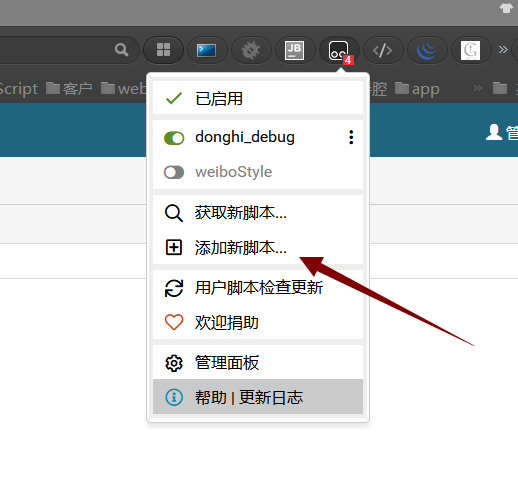
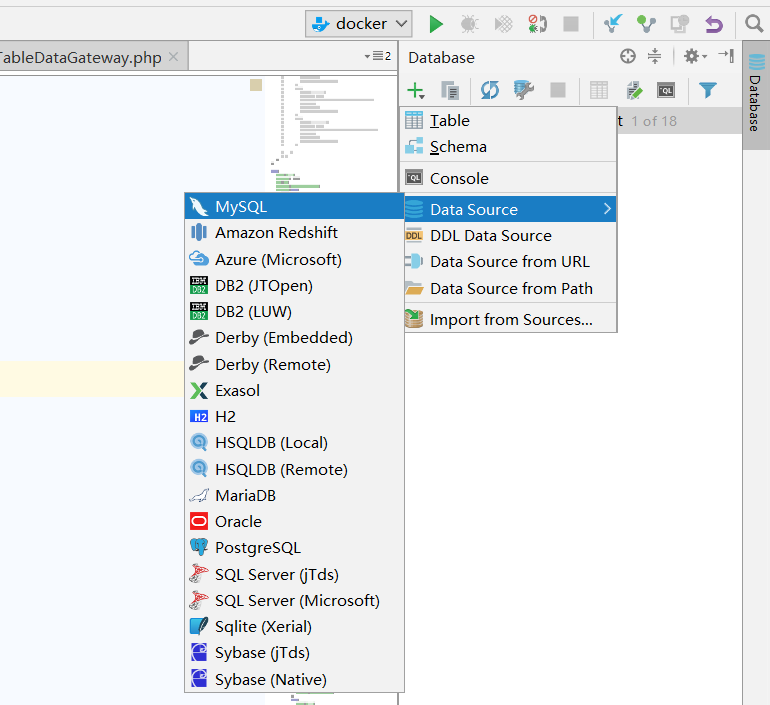
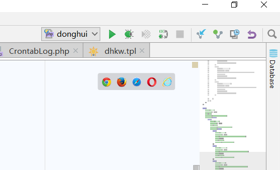
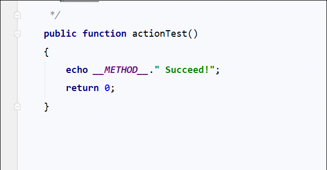
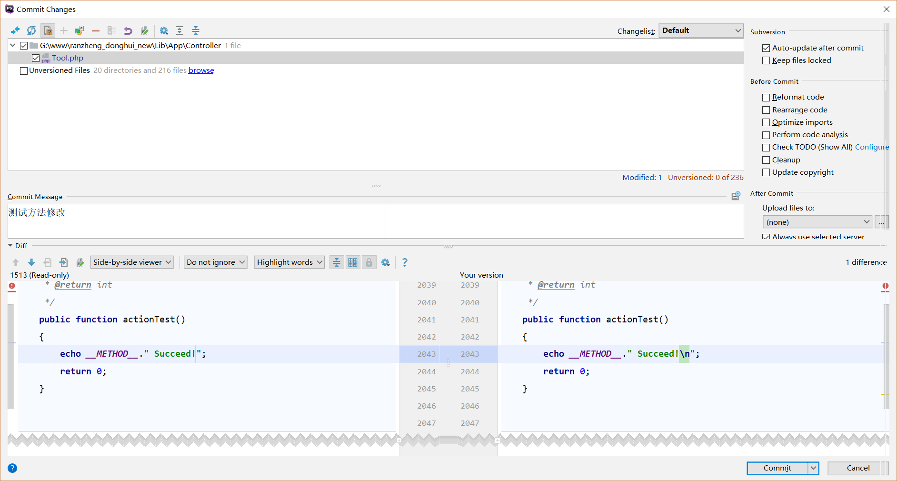
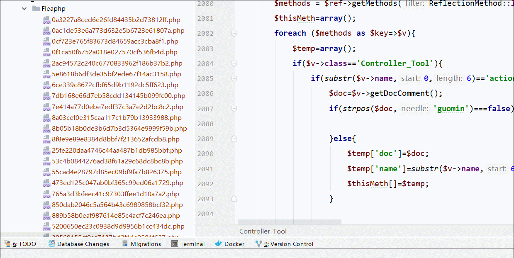

# 几种可以提高速度的调试方法 #
工欲善其事，必先利其器。在着手开发之前，应该对工具加以选择和强化。

虽然前期的配置稍微繁琐，但是磨刀不误砍柴工，一个强大的集成开发环境（IDE）和一些配套的工具必定可以让开发起到事半功倍的效果。
## 浏览器插件tampermonkey(油猴)+脚本显示页面URL ##

使用方法
- chorme或者firefox安装tampermonkey扩展，

- erp项目显示URL脚本示例
		// ==UserScript==
		// @name         donghi_debug
		// @namespace    http://tampermonkey.net/
		// @version      0.1
		// @description  东晖代码调试显示url
		// @author       guomin
		// @match        *://*/*
		// @grant        none
		// ==/UserScript==
	
	    var url = window.location.href;
	    if (url.indexOf('ranzheng_donghui') > 0||url.indexOf('jxc_oubao') > 0) {
	        //自动登录
	        if (url.indexOf('controller=Login&action=index') > 0) {
	            $('#username').val('admin');
	            $('#password').val('dh2018erp');
	            $('#submit').trigger('click');
	        }
	        //显示url
	        else {
	            var s = window.parent.document.getElementById('header');
	            var ps = s.getElementsByTagName('div');
	            var ps0 = ps[0];
	            var index = url.indexOf('?');
	            if (index == -1) {
	                ps0.innerText = '智能制造云管理系统';
	            } else {
	                var text = url.substring(index);
	                var ourl='<a href="'+url+'" target="_blank" style="color: red;">Open</a>';
	                var curl='<a id="copy" style="color: green;cursor: pointer">Copy</a>';
	                var refresh='<a id="refreshMain" style="color: pink;cursor: pointer" >Refresh</a>';
	                text=text+'　'+ourl+'　'+curl+'　'+refresh;
	                ps0.innerHTML = text;
	                ps0.style.fontSize='13pt';
	            }
	        }
	    }

## SQL语句代码补全 ##

设置方法
- phpstrom中连接数据库,点击DataBase面板，点击+，选择MySQL，在弹出窗口中添加数据库名称，密码端口等。

- 其他设置

## sql格式化 ##

## Fleaphp中模型类代码补全 ##

- 设置方法: 将FLEA.php中FLEA::getSingleton方法中返回值改为TMIS_TableDataGateway或者它的派生类。

## 断点调试 ##

设置方法
- 浏览器安装debug helper插件
- 打开插件选项，将IDE key设置为PHPSTORM
- 开启php的Xdebug扩展
- 打开phpStrom界面debug监听按钮

- 打断点，开始调试

## PHPstorm版本控制-集成 ##
- 有改动的行前加提示，点击可对比

- 快速提交 ctrl+K，点击commit即可提交到版本库

## 命令行的灵活使用 ##

## docker创建PHP多版本 ##

## 文档编写工具-markdown ##
本文档即用markdown编辑。