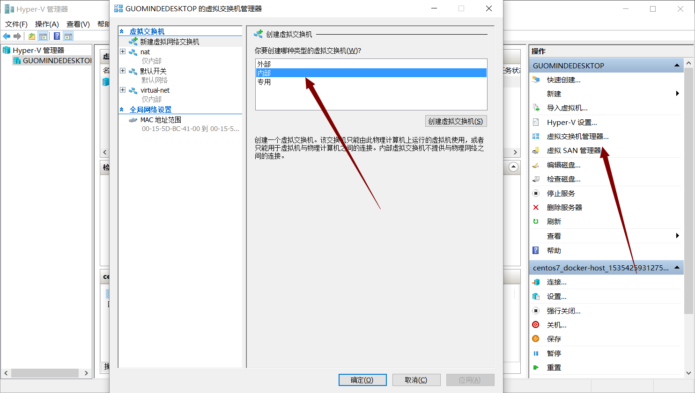
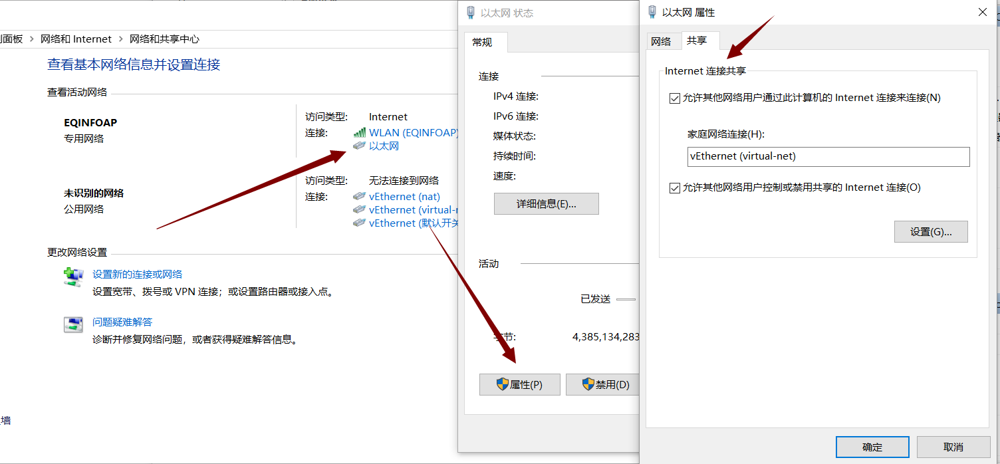
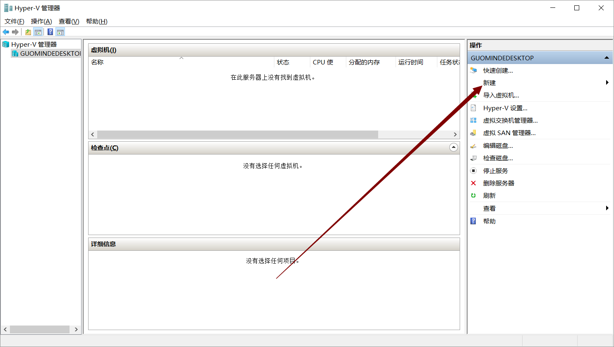
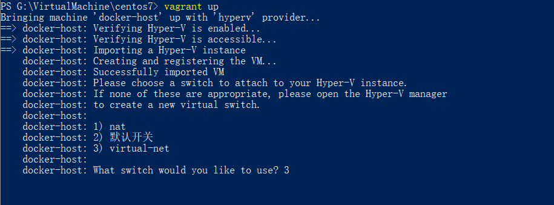
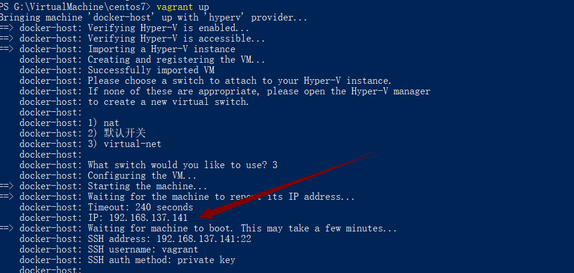
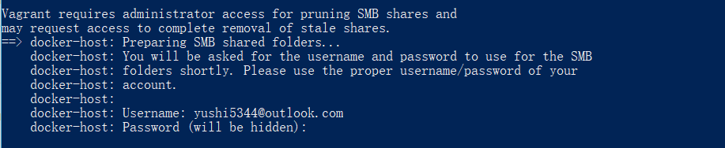

# 使用Hyper-V安装虚拟机  #

创建虚拟交换网络

- 打开hyper-v管理器，点击虚拟交换机管理器，在新建虚拟交换机页面，连接类型选择仅内部。

- 打开 控制面板-网络和 Internet-网络和共享中心，选择当前链接的Internet网络，点击属性-共享，勾选 允许其他网络用户通过此计算机的Internet连接 选项。在下方的家庭网络连接下拉框中选择刚才新建的虚拟交换机网络。

## 通过本地映像文件安装 ##

通过此方法安装虚拟机，需要在安装之前装备好系统映像文件(.iso)  
然后点击操作面板上的新建，根据提示，一步步新建一个虚拟机。

## 通过Vagrant安装虚拟机 ##

因为国内网络原因，访问外网速度较慢，可以先将系统文件通过迅雷等下载到本地，再添加到 Vagrant box list的方法加快安装进度。 

下载centos7 的vagrant安装镜像  
地址 

[https://cloud.centos.org/centos/7/vagrant/x86_64/images/](https://cloud.centos.org/centos/7/vagrant/x86_64/images/)

下载名称中带有HyperV的box.

将下载好的box添加到vagrant的box列表

	vagrant box add box名称 下载好的box路径

比如 
	
	vagrant box add centos7-hyperv H:\vagrant-box\CentOS-7-x86_64-Vagrant-1804_02.HyperV.box  

查看box列表
	
	vagrant box list
	centos/7       (virtualbox, 1804.02)
	centos7-hyperv (hyperv, 0)

创建文件夹  

	mkdir centos7

创建vagrantfile文件

	touch Vagrantfile

Vagrantfile内容如下  

	ENV['VAGRANT_DEFAULT_PROVIDER'] = 'hyperv'
	
	Vagrant.require_version ">= 1.6.0"
	
	boxes = [
	    {
	        :name => "docker-host",
	        :mem => "1024",
	        :cpu => "1"
	    }
	]
	
	Vagrant.configure(2) do |config|
	
	  config.vm.box = "centos7-hyperv"
	    config.vm.define opts[:name] do |config|
	    config.vm.hostname = opts[:name]
	    config.vm.provider "hyperv" do |v|
	    	v.cpus=opts[:cpu]
	      	v.memory=opts[:mem]
	      	v.ip_address_timeout = 240
	      end
	      
	    end
	  end
	end

[Vagrantfile完整内容](./centos-hyperv/Vagrantfile)

vagrantfile中其他可配置参数见 

[https://www.vagrantup.com/docs/](https://www.vagrantup.com/docs/hyperv/configuration.html)

可以看到，在hyperv下，使用vagrant是无法指定虚拟机的ip地址的。

启动 虚拟机 

	vagrant up  

安装过程中，有一步骤是需要指定连接的网络的，选择刚才新建的虚拟交换机网络。

新建的虚拟机的ip地址

进入虚拟机  

	vagrant ssh

停止虚拟机  

	vagrant halt

移除虚拟机  

	vagrant destroy 

注意 

	Hyper-V also requires that you execute Vagrant with administrative privileges. 
	Creating and managing virtual machines with Hyper-V requires admin rights. 
	Vagrant will show you an error if it does not have the proper permssions.

### 关于文件夹共享 ###

在vagrantfile中的配置

	config.vm.synced_folder "G:/www/", "/home/vagrant/www/", type: "smb"

意思是将物理机G盘下www文件夹共享到虚拟机home/vagrant/www目录下 

vagrant通过SMB方式共享文件夹时，需要管理员权限，需要输入物理机账号和密码

